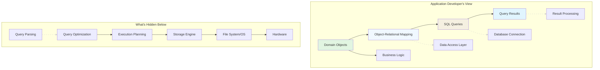
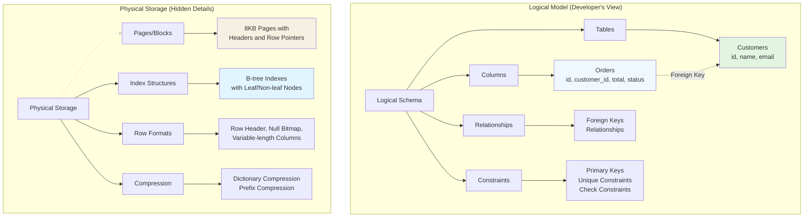

# What Application Developers See

## The Developer's View of Databases

Most application developers interact with databases through abstraction layers that hide the underlying complexity. Understanding what's visible (and what's hidden) at each level helps developers write more efficient, maintainable code and debug performance issues effectively.



## The Three Primary Interfaces

### 1. **Object‑Relational Mapping (ORM)**
The highest abstraction layer where developers work with objects, not tables.

```python
# Django (Python) - Objects and relationships
class Customer(models.Model):
    name = models.CharField(max_length=100)
    email = models.EmailField()

class Order(models.Model):
    customer = models.ForeignKey(Customer, on_delete=models.CASCADE)
    total = models.DecimalField(max_digits=10, decimal_places=2)
    created_at = models.DateTimeField(auto_now_add=True)

# Developer sees: Objects and methods
customer = Customer.objects.get(id=123)
recent_orders = customer.order_set.filter(
    created_at__gte=timezone.now() - timedelta(days=30)
)
```

```java
// Hibernate (Java) - JPA entities
@Entity
@Table(name = "customers")
public class Customer {
    @Id
    @GeneratedValue(strategy = GenerationType.IDENTITY)
    private Long id;
    
    @Column(name = "customer_name")
    private String name;
    
    @OneToMany(mappedBy = "customer")
    private List<Order> orders;
}

// Developer sees: EntityManager operations
Customer customer = entityManager.find(Customer.class, 123L);
List<Order> orders = customer.getOrders();
```

**What ORMs Hide:**
- SQL generation and optimization
- Connection pooling and transaction management
- Data type mappings and conversions
- Lazy vs eager loading decisions

### 2. **SQL Interface**
The declarative language interface where developers specify *what* they want, not *how* to get it.

```sql
-- Developer writes declarative SQL
SELECT c.name, COUNT(o.id) as order_count, SUM(o.total) as total_spent
FROM customers c
LEFT JOIN orders o ON c.id = o.customer_id
WHERE c.country = 'US'
  AND o.created_at > NOW() - INTERVAL '90 days'
GROUP BY c.id, c.name
HAVING COUNT(o.id) > 5
ORDER BY total_spent DESC
LIMIT 10;
```

**What SQL Hides:**
- Join algorithm selection (nested loops vs hash vs merge)
- Index selection and access paths
- Execution order and parallelization
- Memory allocation and disk I/O patterns

### 3. **API/Driver Level**
The programmatic interface for database communication.

```javascript
// Node.js with PostgreSQL driver
const { Client } = require('pg');
const client = new Client();
await client.connect();

// Parameterized queries
const result = await client.query(
  'SELECT * FROM users WHERE email = $1',
  ['user@example.com']
);

// Connection pooling, transactions, prepared statements
```

**What Drivers Hide:**
- Network protocol details
- Authentication and encryption
- Result set streaming and buffering
- Error handling and recovery

## The Logical Data Model vs Physical Storage



**Key Insight:** Developers work with the logical model (tables, relationships, constraints) while the database manages the physical storage (pages, indexes, compression).

## Common Developer‑Facing Database Features

### Schema Definition
```sql
-- Developers define logical structure
CREATE TABLE users (
    id SERIAL PRIMARY KEY,
    username VARCHAR(50) UNIQUE NOT NULL,
    email VARCHAR(255) UNIQUE NOT NULL,
    created_at TIMESTAMP DEFAULT CURRENT_TIMESTAMP,
    is_active BOOLEAN DEFAULT TRUE
);

CREATE INDEX idx_users_created_at ON users(created_at);
CREATE INDEX idx_users_active ON users(is_active) WHERE is_active = TRUE;
```

### Transactions
```python
# Django transaction management
from django.db import transaction

@transaction.atomic
def transfer_funds(sender_id, receiver_id, amount):
    sender = Account.objects.select_for_update().get(id=sender_id)
    receiver = Account.objects.get(id=receiver_id)
    
    if sender.balance < amount:
        raise InsufficientFunds()
    
    sender.balance -= amount
    receiver.balance += amount
    
    sender.save()
    receiver.save()
    
    # Auto‑committed if no exception, rolled back on exception
```

### Views and Materialized Views
```sql
-- Logical abstraction over complex queries
CREATE VIEW customer_summary AS
SELECT 
    c.id,
    c.name,
    COUNT(o.id) as total_orders,
    SUM(o.total) as lifetime_value,
    MAX(o.created_at) as last_order_date
FROM customers c
LEFT JOIN orders o ON c.id = o.customer_id
GROUP BY c.id, c.name;

-- Developer queries the view
SELECT * FROM customer_summary WHERE lifetime_value > 1000;
```

## The N+1 Query Problem: Hidden Complexity

```python
# Naive ORM usage (developer's view)
customers = Customer.objects.filter(country='US')
for customer in customers:
    orders = customer.orders.all()  # Executes N+1 queries!
    for order in orders:
        print(f"{customer.name}: {order.total}")

# What actually happens:
# 1. SELECT * FROM customers WHERE country = 'US'
# 2. SELECT * FROM orders WHERE customer_id = 1
# 3. SELECT * FROM orders WHERE customer_id = 2
# 4. SELECT * FROM orders WHERE customer_id = 3
# ... N queries
```

**Solution with Understanding:**
```python
# Efficient ORM usage
customers = Customer.objects.filter(country='US').prefetch_related('orders')
# Executes: 1. SELECT * FROM customers WHERE country = 'US'
#          2. SELECT * FROM orders WHERE customer_id IN (1, 2, 3, ...)

for customer in customers:
    for order in customer.orders.all():  # Uses cached results
        print(f"{customer.name}: {order.total}")
```

## Performance Bottlenecks Visible to Developers

### 1. **Query Execution Time**
```sql
-- Slow query is visible
SELECT * FROM large_table 
WHERE json_column->>'property' = 'value'
ORDER BY created_at DESC
LIMIT 100;
-- Takes 15 seconds
```

### 2. **Connection Pool Exhaustion**
```javascript
// Too many connections error
app.get('/api/users', async (req, res) => {
  try {
    const client = await pool.connect();  // Might timeout if pool exhausted
    const result = await client.query('SELECT * FROM users');
    client.release();
    res.json(result.rows);
  } catch (err) {
    res.status(500).json({ error: 'Database connection failed' });
  }
});
```

### 3. **Lock Contention**
```java
// Deadlock or timeout errors
@Transactional
public void updateInventory(Long productId, int quantity) {
    // SELECT ... FOR UPDATE
    Product product = entityManager.find(Product.class, productId, 
        LockModeType.PESSIMISTIC_WRITE);
    
    product.setStock(product.getStock() - quantity);
    // Other transaction might be waiting or deadlocked
}
```

## Tools Developers Use to Peek Underneath

### 1. **EXPLAIN / Execution Plans**
```sql
-- See what the database is actually doing
EXPLAIN ANALYZE
SELECT c.name, o.total
FROM customers c
JOIN orders o ON c.id = o.customer_id
WHERE c.country = 'US'
  AND o.created_at > NOW() - INTERVAL '7 days';

-- Output shows:
-- - Join methods used
-- - Index usage
-- - Estimated vs actual rows
-- - Execution time breakdown
```

### 2. **Database‑Specific Profiling**
```sql
-- MySQL: Slow query log
SET GLOBAL slow_query_log = 'ON';
SET GLOBAL long_query_time = 2;  -- Log queries > 2 seconds

-- PostgreSQL: pg_stat_statements
SELECT query, calls, total_time, mean_time, rows
FROM pg_stat_statements
ORDER BY total_time DESC
LIMIT 10;
```

### 3. **ORM‑Specific Debugging**
```python
# Django: Connection queries
from django.db import connection

# See all queries executed
print(connection.queries)

# SQLAlchemy: Echo queries
engine = create_engine('postgresql://...', echo=True)
```

## The Abstraction Leaks: When Details Matter

### Case 1: Bulk Insert Performance
```python
# Naive approach (slow)
for item in data:
    obj = MyModel(field1=item['a'], field2=item['b'])
    obj.save()  # Individual INSERT for each item

# Efficient approach
MyModel.objects.bulk_create([
    MyModel(field1=item['a'], field2=item['b'])
    for item in data
])  # Single multi‑row INSERT
```

### Case 2: JSON Query Performance
```sql
-- Using JSON operators (might be slow without index)
SELECT * FROM products 
WHERE metadata->>'category' = 'electronics'
  AND metadata->>'price'::numeric > 1000;

-- Normalized approach (usually faster)
ALTER TABLE products ADD COLUMN category VARCHAR(50);
ALTER TABLE products ADD COLUMN price NUMERIC;
UPDATE products SET 
  category = metadata->>'category',
  price = (metadata->>'price')::numeric;
  
CREATE INDEX idx_products_category_price ON products(category, price);
```

### Case 3: Pagination at Scale
```sql
-- OFFSET/LIMIT (problematic at scale)
SELECT * FROM large_table ORDER BY id OFFSET 1000000 LIMIT 20;
-- Database must scan 1,000,020 rows

-- Keyset pagination (efficient)
SELECT * FROM large_table 
WHERE id > :last_id  -- From previous page
ORDER BY id LIMIT 20;
-- Uses index seek
```

## Best Practices for Working at This Layer

1. **Understand Your ORM's Queries**
   - Enable query logging in development
   - Learn how to write efficient ORM code
   - Know when to drop to raw SQL

2. **Profile Early and Often**
   - Use `EXPLAIN ANALYZE` for slow queries
   - Monitor query patterns in production
   - Set up database performance dashboards

3. **Design for Performance**
   - Choose appropriate data types
   - Add indexes based on query patterns
   - Consider denormalization for read‑heavy workloads

4. **Handle Connections Properly**
   - Use connection pooling
   - Implement retry logic for transient failures
   - Set appropriate timeouts

5. **Test with Realistic Data**
   - Don't optimize for development‑sized datasets
   - Use production‑like data volumes in testing
   - Consider data distribution and skew

## The Developer's Responsibility

While databases handle many optimizations automatically, developers need to:

1. **Write SQL/ORM code that enables optimization**
2. **Provide the database with sufficient information** (indexes, statistics)
3. **Understand when to work with vs. around abstractions**
4. **Monitor and respond to performance issues**

The best developers know enough about database internals to write code that plays to the database's strengths while staying within the abstraction layers that make development productive.

---

**Next:** Chapter 1.1.3 explores **What database engines actually do** with the queries and data models developers provide.