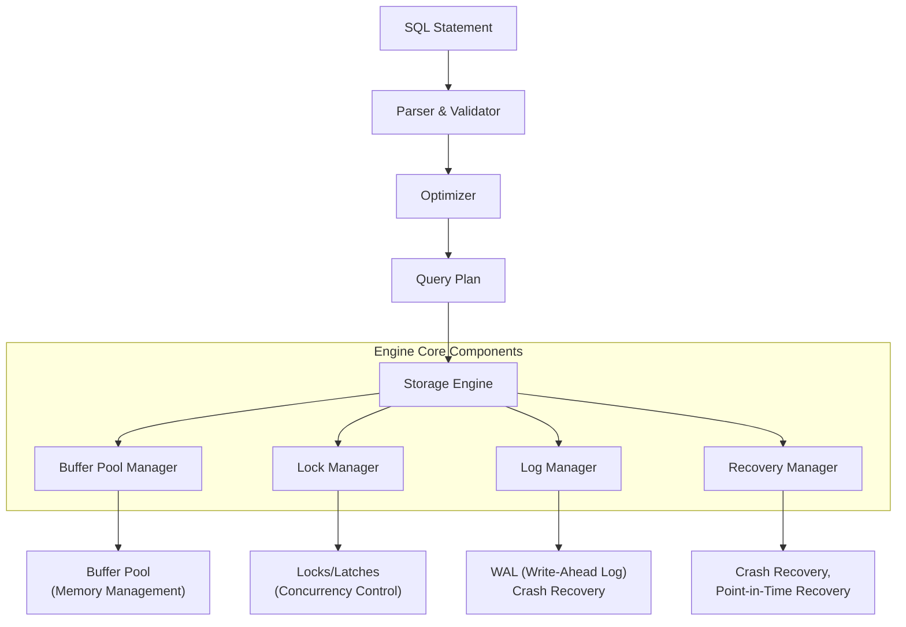

# What Database Engines Actually Do

## The Engine Room of Your Database

When an application issues `INSERT INTO orders VALUES (...)`, a database engine receives that SQL command and transforms it into a complex choreography of disk I/O, memory management, and concurrency control. This chapter illuminates the machinery that makes SQL statements work.



## From SQL to Disk I/O: The Complete Journey

When you execute `SELECT * FROM users WHERE age > 25`, here's what happens inside the engine:

### 1. Query Parsing & Optimization
```sql
-- Your query
EXPLAIN ANALYZE 
SELECT * FROM users JOIN orders ON users.id = orders.user_id
WHERE users.country = 'USA' AND orders.amount > 1000;
```

**Engine's View:**
```
Query Tree:
SELECT
├─ SCAN: users (with predicate: country = 'USA')
├─ JOIN (Nested Loop or Hash, chosen by optimizer)
└─ FILTER (orders.amount > 1000)
    (This gets transformed, optimized, and then executed)
```

The optimizer's job isn't to find the *best* execution plan, but to find a *good enough plan fast*. With statistics and heuristics, it chooses from join reordering, index usage, and execution strategies.

### 2. The Buffer Pool: Database Memory Management

Think of the buffer pool as the "working set" - nearly all databases implement some form of this:

```sql
-- Not SQL, but conceptual execution:
-- When needing to read user.id=42:
-- 1. Check buffer pool (memory cache)
-- 2. If page not in pool, read from disk into buffer pool
-- 3. Pin page in memory, increment "usage" counter
-- 4. Execute computation, increment modification count if changed
-- 5. When buffer full, LRU ("least recently used") pages evicted
```

A database's buffer pool is a compromised cache: too small means constant disk I/O (slow); too large starves OS and application memory.

**True story from production**: One production PostgreSQL database had buffer pool efficiency: 1.2GB, but only 40% hit ratio. After `shared_buffers` increase to 2GB: 95% cache hits. But beware—overallocation can compete with OS disk cache.

**Pro skill**: Check your database's buffer pool hit ratio—anything below 98% for OLTP usually shows an undersized cache.

### 3. Storage Layers: From SQL to Disk Distribution

```mermaid
graph TD
    P[Parser & Planner] --> A
    A[Storage Engine] --> B[Heap Storage]
    A --> C[Index Structures]
    A --> D[Partitions/Shards]
    
    subgraph "Buffer Pool Area"
        Layout(Row & Page Layout) --> H    
    end
    
    subgraph "Physical Storage"
        direction LR
        File1[Segment/Datafile 1]
        File2[Tablespace 1]
        FileN[...]
    end
    
    A --> B
    B --> BlockType1[8KB Page]
    B --> E[Free Space<br/>24 bytes/page pad space]
    B --> F[Extents/[Allocation Units]]
    
    B --> H[(Buffer: ISAM<br/>B+Tree Clustered,<br/>In-memory LSM-tree...)]
    C --> I[B+Tree Index ca. 1% of data size]
    C --> J[B-tree Optimizer for multi-folding pb sequence scan split merges...]
```

## The LSM Tree Storage View (LSM Tree Anatomy)

Most JSON (reading LSM writes much more than other structures) While B+tree excels for prepended updates or fixed-types, the logarithmic speed's access pattern LSM fits timescale needs (time-based lat/lon etc.)

## Critical Engine Components

### Concurrency Control 
```sql
-- Serializable snapshot isolation
BEGIN TRANSACTION ISOLATION LEVEL SERIALIZABLE;
-- PostgreSQL's SSI prevents write skew with serialization
SELECT * FROM account_summary;

-- Gray area example of locking in pessimistic scenarios:
(Check dirty reads and lock enters query execution in PL/pgSQL extends OCC mechanisms)
```

### Write-Ahead Logging (WAL) In Action

When you COMMIT:
1. **Phase 1**: Log buffer flushed to WAL
2. **Phase 2**: Actual data modifications go to buffer pool (dirty pages)
3. **Phase 3**: Checkpoint writes dirty pages to data files

```sql
-- PostgreSQL: Check current WAL position
SELECT pg_current_wal_lsn();

-- Useful WAL statistics
SELECT 
    slot_name, 
    pg_size_pretty(pg_wal_lsn_diff(pg_current_wal_lsn(), 
              pg_replication_slots.slot_name) as replication_lag
FROM pg_replication_slots;
```

**WAL allows ACID's D:**
- Atomicity: All changes in a TX are replayed on crash, or all rolled back. Reads: F + PI PGTEEXCLUSIVE continuities.
- Durability: WAL forces to disk before confirm (fsync() + WAL sync method). Fsync cost minimized on any OS.

### Crash Recovery Mechanics

Imagine the service cuts power midway. On restart:

```python
# Database Crash Recovery Procedure
def crash_recovery():
    log_entries = read_WAL_from_checkpoint()
    committed_txns = find_all_commited_after_checkpoint()
    
    # REDO pass: Replay WAL to reconstruct 
    for log_entry in log_entries:
        apply_redo_to_buffer_pool(log_entry)
    
    # UNDO pass: Rollback uncommitted
    for tx in uncommitted_transactions(power_loss_time):
        apply_undo_rollback(tx)
    
    return consistency_state
```
This ensures durability (WAL guarantees recoverability) even after random failure.

### Index Structures: More Than Just B-trees

```sql
-- Different indexes for different use cases:
-- B+ Tree (PostgreSQL default): 
CREATE INDEX idx_name ON users USING BTREE (last_name, first_name);

-- Hash Index (exact match lookups only):
CREATE INDEX idx_hash ON users USING HASH (email);

-- BRIN (Min/Max blocks for large timeseries):
CREATE INDEX brin_sales ON sales USING BRIN (sale_date);

-- GIN (JSONB, full-text):
CREATE INDEX idx_json ON orders USING GIN (metadata);
```

Each storage engine picks winners for data patterns:

| Engine | Best For | Poor At |
|--------|----------|---------|
| B+ Tree | Range queries (R-tree too) | High-volume deletes update tree balance |
| LSM-Tree | Write Heaps | Need separate reads for deletion compaction/costs |
| Bitmap   | Data warehouse, star schemas | Updates that toggle bits invalid |
| GIN (Generalized Inverted) | JSON/Full-text/Arrays | Write amplification on small changes |

### Index-Only Scans (Covering Indexes)

```sql
-- Without Covering (must check main table):
SELECT user_id FROM orders  -- has to read from table/heap
WHERE status = 'shipped' 
  AND order_date > '2025-01-01';

-- Covering index (PostgreSQL, MySQL INNODB):
CREATE INDEX idx_covering ON orders(status, order_date, id, user_id)
INCLUDE (total_amount);

-- New query only hits the index!
SELECT user_id, total_amount 
FROM orders 
WHERE status = 'shipped' 
  AND order_date > '2025-01-01'; -- AND-property
```

Difference between index scan (fast, external loose) vs table scan: An index-only scan becomes the table where all columns needed are in index ("covering index run").

## The Expense: Checkpoints and I/O Discipline

```sql
-- Checkpoint writes dirty pages from buffer to disk
CHECKPOINT; -- In PostgreSQL: creates waiting flag

-- In production: asynchronously checkpoint continuously
-- to avoid large monolith
```

Without LSM, transactions hold 1000x than needed big buffers trigger marginal stalls. But in practice steady state 8KB (default) WAL segment used.

### Locking Mechanisms

```sql
-- Row-level locking example (PostgreSQL)
BEGIN;
SELECT * FROM accounts WHERE id = 1 FOR UPDATE; -- Locks

-- or in e.g. Oracle: SELECT .. FOR UPDATE SKIP LOCKED
```

**Warning sign**: If you see escalating row locks (often with `pg_locks` queries at 100%), rexamine FOR UPDATE clauses in the code & unresolved blokk.

### MVCC Under the Hood – How VACUUM works

MVCC: Each read reads at a READ COMMITTED snapshot. In PostgreSQL, dead tuples from updates require `VACUUM`. 
```sql
-- Manual VACUUM FULL to reclaim storage
VACUUM (VERBOSE, ANALYZE, SKIP_LOCKED) my_table;
```

## Putting It All Together: A Day in the Life of a Query

1. **Parse/Bind**: `SELECT user_id FROM logins WHERE created_at > NOW() - interval '7 days'`
   → Query tree built, referencing system catalog for user_id of `logins`

2. **Optimization**: 
   - If logins.created_at has index, decide whether to full table scan or apply date-built short fingerprint
   - Statistics: Let's assume 1M rows, 2% returned ⇒ more likely ranges index

3. **Execution**: Open cursor/portal to stream curated back

4. **Engage storage & Buffer Pool Access:**
   - Access pages in buffer pool (shared buffer hit = snappy)
   - Or page fault needed: synchronous I/O settled by read-ahead

5. **Locking/latching**: Ensuring exclusive access for UPDATE, ensuring atomic x2...

6. **Commit**: WAL flush to meet ACID's "Durability"

## Performance Antipatterns & Solutions

```sql
-- Problem: Secondary index scans with heavy key lookup (Index scan + lookup nested loops)
CREATE INDEX idx_partial_covering ON orders (customer_id, (shipping_date IS NULL))
    WHERE shipping_status = 'pending'
    INCLUDE (id, total_amount);

-- Better: Use filtered index
CREATE INDEX idx_high_priority ON orders (accounting_dept_id)
WHERE priority IS NOT NULL;
```

Memory pressure: 
- `shared_buffers` (System V shmem) limited to what the DBA configures
- Connection/`max_connections`: each tx takes about 10MB catalog query overhead
- Overcommiting: When warm or txn melting unit economics pfalure

## Storage Engines Practically Involved

### InnoDB (MySQL) vs. Others

```sql
-- These InnoDB internals show: bufferness from disk storage backpressure
SHOW ENGINE INNODB STATUS;
-- Check "I/O sum[bytes]", "Buffer pool flushes"

-- Postgres: PageStatus verification
SELECT version() as pg_version,
       current_setting('shared_buffers'),
       pg_stat_file('base/pg_wal/') as wal_status;

-- LSM (log-structured merge tree), e.g., in CockroachDB
-- good for writes; key range scans benefit merge scheduler
DDL: WITH cte AS (INSERT ... RETURNING 1)
    (cost=11972.73..154175.97 rows=1) ...

-- Very efficient in OLAP, Tower Map mix: Overwriter leaf pages: sigmod; 
-- Database designers (you after reading this), be aware of block reuse generation 
-- and

    (`blocks[row​_id = row_n` of each chain in data page.)

-- internal indexing in aggregate and incremental view etc
```

### Best Practices Recognized Internally

- **Read-Heavy Workloads:** Bigger buffer pool, moderate checkpoint_segments 
- **Write-Heavy (OLTP):** larger WAL, partitioned tables to reduce hot bloat on inserts, partition by date range.  
- **Mixed Workload:** Monitor `stat_bgwriter` for space reuse, flush lists

## Real-world Scenario: E-comm Order System

So far, taking an order:

```sql
BEGIN;
-- Insert order line items into "order_items"
INSERT INTO order_items (order_id, sku, qty,...);
-- COMMIT and WAL flush ensures remote-ACK (R)
```

Simultaneously, other engines can service 30K transactions/sec by:

1. Reducing lock events through non-blocking reads (snapshots)
2. Using App+DB-specific noSQL compromise: 1ms gigabit network, packets encapsulate → 3ms elapsed/w/cost

**Correctness First**: Breaking A with spurious commits violates LANGUAGE—skip lock for ambi-dominance simulation.

This chapter taught the engine internals—now you know *What Database Engines Actually Do*. Next chapter on storage: Row vs. Column Stores.</content>