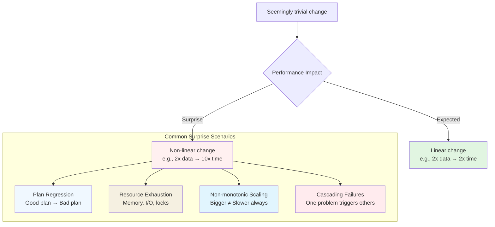
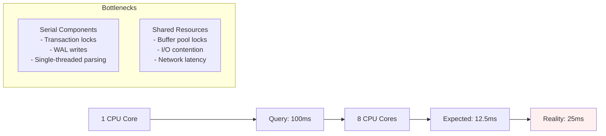

# Performance Surprises

## When Databases Don't Behave as Expected

Database performance is rarely linear or predictable. Small changes in data volume, distribution, or access patterns can lead to unexpectedly large performance impacts. This chapter explores the counterintuitive behaviors that surprise even experienced developers.



## The Non‑Linear Nature of Database Performance

### Case Study: The Query That Worked Yesterday

```sql
-- This worked fine with 10,000 users
SELECT * FROM user_sessions 
WHERE user_id = ? 
  AND created_at > NOW() - INTERVAL '30 days'
ORDER BY created_at DESC
LIMIT 50;

-- What changed? User growth to 1,000,000 users
-- Suddenly: Full table scan instead of index usage
-- Execution time: 50ms → 5 seconds
```

**Root Cause:** Statistics became stale, causing the optimizer to misestimate row counts. At 10,000 users, a full scan was reasonable. At 1,000,000 users, the same plan was catastrophic.

### The Threshold Effect

Many database operations have performance cliffs:

| Resource | Safe Zone | Danger Zone | Performance Impact |
|----------|-----------|-------------|-------------------|
| **Working Memory** | < 75% of `work_mem` | > 90% of `work_mem` | Spill to disk: 100x slower |
| **Buffer Pool** | > 95% hit rate | < 85% hit rate | Disk I/O dominates |
| **Lock Contention** | < 5% wait time | > 20% wait time | Queueing delays explode |
| **Index Fragmentation** | < 30% fragmentation | > 70% fragmentation | Index scans degrade |

## Common Performance Surprises

### 1. The N+1 Query Problem That Wasn't Always There

```python
# Code that worked fine in development
def get_user_orders(user_id):
    user = User.objects.get(id=user_id)
    orders = []
    for order in user.orders.all():  # N+1 queries
        orders.append({
            'id': order.id,
            'items': [item.name for item in order.items.all()]  # Another N+1!
        })
    return orders

# Development: 10 orders × 5 items = 11 queries (fine)
# Production: 1000 orders × 20 items = 20,001 queries (disaster)
```

**The Surprise:** Performance degrades geometrically with data growth, not linearly.

### 2. The Innocuous Index That Kills Writes

```sql
-- Adding an index to speed up reads
CREATE INDEX idx_users_country_city ON users(country, city);

-- Unintended consequence:
-- Every INSERT now requires updating this index
-- Write throughput drops from 10,000/sec to 1,000/sec
-- Index maintenance consumes 30% of CPU
```

**Rule of thumb:** Each additional index adds overhead to writes. Balance read vs. write performance.

### 3. The Parameter Sniffing Surprise

```sql
-- Stored procedure works perfectly in testing
CREATE PROCEDURE GetOrders(@customer_id INT)
AS
BEGIN
    SELECT * FROM orders 
    WHERE customer_id = @customer_id
    ORDER BY order_date DESC;
END;

-- Test with Customer 123 (3 orders): Uses index seek (fast)
-- Production with Customer 456 (50,000 orders): Same plan → full scan (slow)
-- Same query, same plan, wildly different performance
```

### 4. The Memory Surprise: Hash Joins vs. Nested Loops

```sql
-- Small table join (developer's laptop)
SELECT * FROM small_table s 
JOIN medium_table m ON s.id = m.small_id;

-- Optimizer chooses hash join (fast for small datasets)

-- Production: Tables are 100x larger
-- Hash join requires 8GB of working memory
-- Database spills to disk: 5 seconds → 5 minutes
```

**The lesson:** Test with production‑sized data, not development samples.

## Scalability Surprises

### 1. Amdahl's Law Meets Databases

Even perfect linear scaling hits bottlenecks:



**Formula:** `Speedup = 1 / (S + (1-S)/N)` where S is serial fraction, N is cores.

If 20% of your query is serial (locks, WAL), maximum speedup with infinite cores is 5x.

### 2. The Connection Pool Wall

```python
# App server configuration
connection_pool_size = 20  # Seems reasonable

# What happens under load:
# - 100 concurrent requests
# - 20 get connections immediately
# - 80 queue (increasing latency)
# - Queued requests timeout
# - Cascade: Timeouts → retries → more load
```

**The surprise:** Connection pool exhaustion doesn't cause graceful degradation—it causes catastrophic failure.

### 3. Write Amplification in LSM‑Trees

```sql
-- RocksDB/MyRocks write pattern
INSERT INTO logs (timestamp, message) VALUES (NOW(), 'event');

-- What actually happens:
-- 1. Write to MemTable (memory)
-- 2. Flush to L0 (disk)
-- 3. Compaction L0 → L1 (rewrite)
-- 4. Compaction L1 → L2 (rewrite)
-- 5. ... Multiple rewrites

-- Write amplification: 10-50x
-- Small writes trigger large disk operations
```

## Predictability Challenges

### 1. The Statistics Problem

```sql
-- Last statistics update: 1 week ago
-- Table grew from 1M to 10M rows
-- Statistics say: "Most customers have 1-5 orders"
-- Reality: New enterprise customers have 10,000+ orders
-- Optimizer picks nested loops join (disastrous)
```

**Solution:** Regular `ANALYZE` or `UPDATE STATISTICS`, but at a cost.

### 2. The "Fast Now, Slow Later" Query

```sql
-- Efficient with current data distribution
SELECT * FROM products 
WHERE category = 'electronics' 
  AND price BETWEEN 100 AND 200
  AND stock_count > 0;

-- Problem: The "electronics" category grows 10x
-- Secondary problem: Price distribution shifts
-- Tertiary problem: Stock patterns change seasonally
```

**Defense:** Monitor query performance over time, not just at deploy.

### 3. The Cache Invalidation Surprise

```sql
-- Heavily cached query
SELECT COUNT(*) FROM orders 
WHERE status = 'pending' 
  AND created_at > NOW() - INTERVAL '1 hour';

-- Cache hit rate: 99%
-- Response time: 2ms

-- What changes: DST time change
-- Cache invalidated by timestamp shift
-- Suddenly: 100% cache misses
-- Response time: 200ms (100x slower)
```

## Real‑World Surprise Scenarios

### Scenario 1: The Friday Afternoon Deployment

```sql
-- Deploy "optimization": Add composite index
CREATE INDEX idx_optimized ON orders(customer_id, status, created_at);

-- Monday morning: Order volume 10x normal (sale)
-- New index perfect for reads... but:
-- Index maintenance consumes all I/O bandwidth
-- Checkpoints stall
-- Database becomes unresponsive
```

**Takeaway:** Test optimizations under peak load, not average load.

### Scenario 2: The Cascading Foreign Key

```sql
-- Seemingly harmless foreign key
ALTER TABLE order_items 
ADD CONSTRAINT fk_order 
FOREIGN KEY (order_id) REFERENCES orders(id) 
ON DELETE CASCADE;

-- What happens when deleting old orders:
-- DELETE FROM orders WHERE created_at < '2023-01-01';
-- Each order has ~10 items
-- 1M orders → 10M individual deletes
-- Execution: Estimated 1 hour, actual 12 hours
-- Lock contention freezes application
```

### Scenario 3: The AUTO_INCREMENT Gap

```sql
-- High‑volume table with gaps
INSERT INTO event_log (message) VALUES ('event1');
ROLLBACK; -- ID 1 allocated but not used
INSERT INTO event_log (message) VALUES ('event2'); -- ID 2

-- After millions of rollbacks:
-- Gaps consume significant space
-- Index fragmentation increases
-- Range queries slow down unexpectedly
```

## Mitigation Strategies

### 1. Proactive Monitoring

```sql
-- PostgreSQL: Track plan changes
SELECT queryid, query, plans, total_plan_time,
       mean_plan_time, stddev_plan_time
FROM pg_stat_statements
WHERE stddev_plan_time > mean_plan_time * 2; -- Volatile queries

-- MySQL: Performance schema
SELECT * FROM performance_schema.events_statements_summary_by_digest
WHERE SUM_TIMER_WAIT > 1000000000
ORDER BY SUM_TIMER_WAIT DESC;
```

### 2. Load Testing with Realistic Data

```python
# Don't test with uniform data
test_data = generate_realistic_data(
    skew_factors={
        'customer_orders': 'zipf',  # Some have many, most have few
        'product_prices': 'normal',
        'temporal_patterns': 'seasonal'
    }
)
```

### 3. Gradual Rollouts

```sql
-- Instead of: CREATE INDEX CONCURRENTLY idx_new ...
-- Try: Partial index first
CREATE INDEX idx_new_partial ON orders(customer_id, status)
WHERE created_at > NOW() - INTERVAL '30 days';

-- Monitor performance
-- If good, expand gradually
```

### 4. Circuit Breakers

```python
# Application‑level protection
def execute_query_with_timeout(query, timeout_ms=1000):
    try:
        result = connection.execute(query, timeout=timeout_ms)
        return result
    except TimeoutError:
        # Fall back to cached result or simplified query
        return get_cached_or_simplified_version(query)
```

## The Psychology of Performance Surprises

### Why We're Surprised:

1. **Linear Thinking:** We expect 2x data → 2x time
2. **Isolated Thinking:** We consider components separately
3. **Static Thinking:** We assume today's behavior is tomorrow's
4. **Deterministic Thinking:** We expect consistent performance

### How to Think Differently:

1. **Think in Orders of Magnitude:** What happens at 10x, 100x scale?
2. **Consider Interactions:** How do components affect each other?
3. **Plan for Change:** How will data/distribution evolve?
4. **Expect Variability:** Performance isn't constant

## Key Takeaways

1. **Performance scales non‑linearly** – Small changes can have large impacts
2. **Context matters** – What works at one scale fails at another
3. **Everything is connected** – Optimizations have side effects
4. **Monitor, don't assume** – Trust data, not intuition
5. **Test realistically** – Use production‑like data and load

The most dangerous assumption in database performance is "it will scale linearly." The real world is full of thresholds, tipping points, and unexpected interactions. By understanding common surprise patterns, you can anticipate problems before they become crises.

---

**Next:** Chapter 1.2.2 explores **Concurrency anomalies** – what happens when multiple users interact with the same data simultaneously.