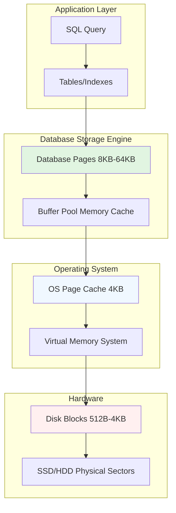
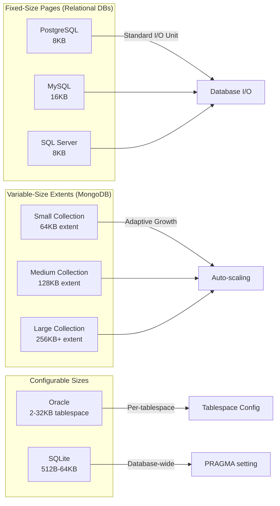
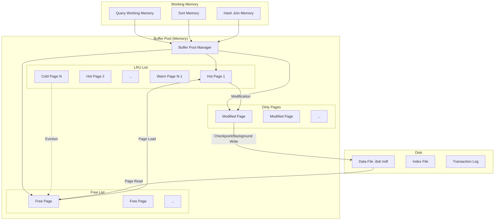
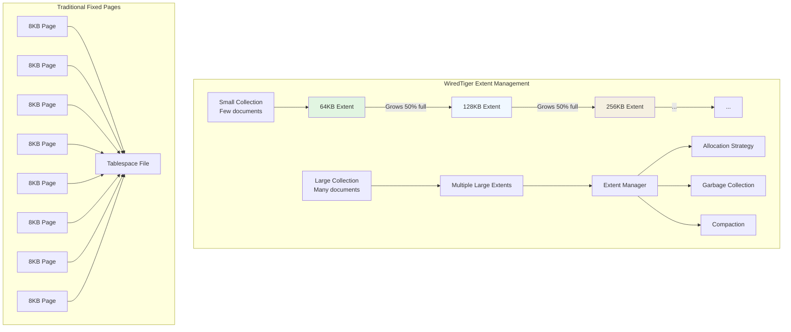

# Disk, Memory, and the Page Abstraction

## What is a Page?

A *page* (sometimes called a *block* or *extent*) is the basic unit of I/O that a storage engine reads from or writes to the underlying storage medium.  All modern relational databases allocate and manage data in fixed‑size pages because it aligns nicely with the operating system’s disk cache and reduces the number of system calls required to process large tables.

## The Page Abstraction Stack



**Key Insight:** Database pages are typically larger than OS pages and disk blocks. This means:
- One database page = multiple OS pages
- One OS page = one or more disk blocks
- This hierarchical arrangement allows databases to manage their own caching (buffer pool) while still leveraging the OS page cache

## Database Page Anatomy

```mermaid
graph LR
    P[Database Page 8KB-16KB] --> H[Page Header 24-128 bytes]
    P --> RP[Row Pointers Array]
    P --> FS[Free Space]
    P --> D[Row Data]
    P --> T[Tuple Data]
    
    subgraph "Page Header Details"
        H1[LSN - Log Sequence Number]
        H2[Checksum]
        H3[Page Type]
        H4[Free Space Pointer]
        H5[Row Count]
    end
    
    subgraph "Row Data Layout"
        D1[Row Header]
        D2[Null Bitmap]
        D3[Column 1 Data<br/>VARCHAR(100)]
        D4[Column 2 Data<br/>INTEGER]
        D5[Column 3 Data<br/>TIMESTAMP]
    end
    
    H --> H1
    H --> H2
    H --> H3
    H --> H4
    H --> H5
    
    D --> D1
    D --> D2
    D --> D3
    D --> D4
    D --> D5
```

**Page Header:** Contains metadata about the page (when it was last modified, what type of page it is, how much free space remains).
**Row Pointers Array:** An array of offsets pointing to where each row starts within the page (allowing rows to be moved without updating all indexes).
**Free Space:** The gap between the row pointers and the actual row data that grows/shrinks as rows are inserted/deleted.
**Row Data:** The actual row content stored in the page.

## Default Page / Block Sizes in Popular Databases

| Database | Default Page / Block Size | Notes |
|----------|---------------------------|-------|
| **PostgreSQL** | 8 KB (configurable at initdb with `-D` and `-B`) | Fixed size; larger pages can be set at cluster creation time.
| **MySQL (InnoDB)** | 16 KB (configurable via `innodb_page_size` up to 64 KB) | Must be set before the tablespace is created.
| **Oracle** | 8 KB (default) – can be 2 KB, 4 KB, 8 KB, 16 KB, or 32 KB | Chosen per tablespace at creation.
| **SQL Server** | 8 KB (fixed for data pages) | Index and row‑overflow pages are also 8 KB; large rows spill to *LOB* pages.
| **SQLite** | 4 KB (default) – configurable with `PRAGMA page_size` | Page size must be a power of two between 512 B and 65536 B.
| **MongoDB** | Variable – *records are stored in *extents* that start at 64 KB and grow geometrically* | MongoDB does not use a fixed page size; instead it allocates extents that double in size until a configured limit. |

### Page Size Comparisons



### Why the Defaults Matter

* **I/O Efficiency** – Larger pages reduce the number of reads/writes for sequential scans but can increase waste for small lookups.
* **Memory Footprint** – The buffer pool holds a number of pages; the total memory usage is `page_size × number_of_cached_pages`.
* **Concurrency & Locking** – Some engines lock at the page level; larger pages can increase contention.
* **Fragmentation** – Fixed‑size pages can lead to internal fragmentation when rows do not exactly fill the page.

## Memory vs. Disk: The Buffer Pool



**The Buffer Pool Lifecycle:**
1. Page requested by query
2. If in buffer pool (cache hit), use immediately
3. If not in buffer pool (cache miss), read from disk into free page
4. Page becomes "hot" (frequently accessed) and moves to LRU head
5. Page becomes "cold" (infrequently accessed) and moves to LRU tail
6. When buffer pool is full, cold pages are evicted
7. Modified (dirty) pages are written to disk during checkpoints

## MongoDB’s Variable‑Size Extents

MongoDB’s storage engine (WiredTiger) does not adhere to a single, fixed block size. Instead, it allocates *extents* that start at 64 KB and then grow roughly by a factor of 2 (128 KB, 256 KB, …) until they hit a configurable maximum (default 2 GB). This design:



1. **Adapts to Workload** – Small collections start with tiny extents, conserving disk space. Large collections automatically acquire larger extents, reducing metadata overhead.
2. **Reduces Allocation Overhead** – Growing extents avoid the need to frequently allocate many tiny blocks.
3. **Impacts Vacuum / Compaction** – Because extents can be variably sized, compaction may need to rewrite entire extents rather than individual pages.

When comparing MongoDB to relational databases, keep in mind that its *block* concept is more fluid. For performance‑tuning discussions, you’ll often talk about *WiredTiger cache size* (default 50 % of RAM) rather than a page size.

## Practical Takeaways

* For relational DBMSs, the default page size is a key tuning knob that influences I/O patterns, memory usage, and lock granularity.
* In MongoDB, the emphasis shifts to extent management and cache configuration rather than a static page size.
* When designing a schema or indexing strategy, always consider how many pages a typical row or document will occupy and whether that fits the engine’s default block size.

## Performance Implications

| Operation | Small Pages (4KB) | Large Pages (16KB+) |
|-----------|-------------------|---------------------|
| **Random Lookup** | More I/O operations for same data | Fewer I/O ops, but may read unused data |
| **Sequential Scan** | Many small reads | Fewer larger reads, more efficient |
| **Memory Cache** | More pages fit in same memory | Fewer pages fit, but each has more data |
| **Write Amplification** | Lower (write less data) | Higher (write more data per update) |
| **Concurrency** | Fine-grained locking | Coarse-grained locking, more contention |

**Rule of Thumb:** OLTP workloads (many small random reads) may benefit from smaller pages. OLAP/workloads (large sequential scans) often benefit from larger pages.

---

*This section provides a quick reference for developers who need to reason about storage layout across different database families.*
