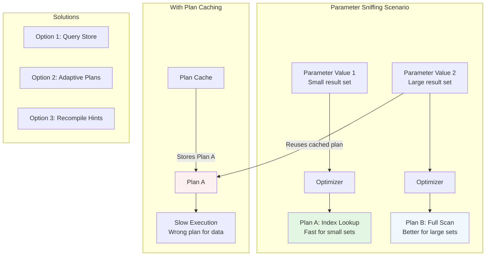
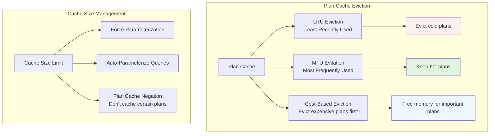

# Plan Caching and Adaptive Plans

## The Plan Reuse Problem

When a database receives the same SQL query repeatedly, re‑planning from scratch for each execution would waste CPU cycles and introduce unnecessary latency. **Plan caching** solves this by storing compiled execution plans so subsequent executions can reuse them.

```mermaid
graph LR
    Q1[SQL Query<br/>SELECT * FROM users WHERE id = ?] --> P[Parser]
    P --> AST[Abstract Syntax Tree]
    AST --> O[Optimizer]
    O --> EP[Execution Plan]
    
    subgraph "First Execution"
        EP --> C[Cache Key<br/>Hash(query text,<br/>schema version,<br/>parameters)]
        C --> PC[Plan Cache]
    end
    
    subgraph "Subsequent Executions"
        Q2[Same Query] --> LK[Lookup Cache Key]
        LK -->|Cache Hit| RC[Reuse Plan]
        LK -->|Cache Miss| N[New Plan Generation]
        RC --> EX2[Fast Execution]
        N --> EX1[Slow Execution]
    end
    
    style PC fill:#e1f5e1
    style RC fill:#f0f8ff
```

## What Gets Cached?

Different databases cache different plan components:

| Database | What's Cached | Lifetime | Invalidation Triggers |
|----------|---------------|----------|----------------------|
| **PostgreSQL** | Prepared statements only (explicit `PREPARE`) | Until session ends | Schema changes, `ANALYZE`, configuration changes |
| **MySQL** | Query plans for prepared statements | Global cache | Table modifications, index changes, cache size limits |
| **SQL Server** | Compiled execution plans | Global plan cache | Statistics updates, memory pressure, recompilation hints |
| **Oracle** | Cursors (includes parse tree + execution plan) | Shared pool | SQLID mismatch, bind variable peeking changes |
| **SQLite** | Prepared statements only | Connection lifetime | Schema changes |

**Key Insight:** Not all databases automatically cache all plans. Some require explicit preparation; others cache automatically but may invalidate frequently.

## The Parameter Sniffing Problem

Consider this query with different parameter values:

```sql
-- Different executions with same plan
SELECT * FROM orders WHERE customer_id = ? AND status = 'PENDING'
```

If the first execution uses `customer_id = 123` (who has 3 pending orders), the optimizer creates a plan optimized for few rows (index lookup).  
If the second execution uses `customer_id = 456` (who has 50,000 pending orders), the same plan is terrible—a full table scan would be better!



## Adaptive Query Processing

Modern databases use **adaptive plans** that can adjust during execution:

### 1. **Adaptive Join Operators**
```sql
-- During execution, the database can switch join methods
SELECT o.*, c.name 
FROM orders o 
JOIN customers c ON o.customer_id = c.id
WHERE o.region = 'EUROPE';
```

**What happens:**
1. Optimizer picks hash join (assuming large intermediate result)
2. During execution, if actual rows are small, switches to nested loops
3. Or vice versa: starts with nested loops, switches to hash join if data is larger than expected

### 2. **Interleaved Execution**
SQL Server's feature that pauses execution after processing the first table, re‑estimates cardinality, then chooses the best join method.

### 3. **Feedback Loops**
PostgreSQL's **JIT compilation feedback**: If a query runs many times, PostgreSQL can JIT‑compile it for better performance.

## Database‑Specific Adaptive Features

| Database | Adaptive Feature | How It Works |
|----------|-----------------|--------------|
| **SQL Server** | Adaptive Joins | Can switch between hash/nested loops during execution based on actual row count |
| **Oracle** | Adaptive Plans | Multiple sub‑plans prepared; switches at runtime based on statistics |
| **PostgreSQL** | JIT Compilation | Frequently executed queries get Just‑In‑Time compilation for faster execution |
| **MySQL 8.0** | Hash Join Adaptive | Can switch join algorithms based on runtime statistics |
| **CockroachDB** | Vectorized Execution | Adaptive vectorization based on data characteristics |

## Plan Cache Management Strategies

### 1. **Plan Eviction Policies**


### 2. **Parameterization Strategies**
- **Simple Parameterization**: Convert literal values to parameters (`SELECT * FROM users WHERE id = 123` → `SELECT * FROM users WHERE id = @p1`)
- **Forced Parameterization**: Always parameterize (can be problematic for partitioned tables)
- **Partial Parameterization**: Parameterize only safe literals

## Real‑World Examples

### Example 1: E‑Commerce Search
```sql
-- Problem: Different customers have vastly different order counts
SELECT * FROM orders 
WHERE customer_id = ? 
  AND order_date > DATE_SUB(NOW(), INTERVAL 90 DAY)
```

**Without adaptive plans:** One customer with 2 orders gets fast index lookup; another with 10,000 orders suffers with same plan.
**With adaptive plans:** Database detects row count during execution, may switch to table scan for large result sets.

### Example 2: Multi‑Tenant SaaS Application
```sql
-- Each tenant has different data distribution
SELECT user_id, COUNT(*) as login_count
FROM user_sessions 
WHERE tenant_id = ? 
  AND login_date BETWEEN ? AND ?
GROUP BY user_id
```

**Challenge:** Tenants have different user counts (10 vs 10,000 users).
**Solution:** Adaptive aggregation that can switch from hash‑based to sort‑based grouping.

## Performance Implications

### When Plan Caching Helps
- **OLTP workloads** with repeated simple queries
- **Web applications** with parameterized queries
- **Connection‑pooled applications** where queries are reused across connections

### When Plan Caching Hurts
- **Parameter sniffing problems** (one bad plan cached for all)
- **Frequently changing data distributions**
- **Ad‑hoc query workloads** where few queries repeat

## Best Practices

1. **Use bind variables/parameters** – Enables plan reuse
2. **Monitor plan cache hit ratio** – Aim for >90% in OLTP systems
3. **Be cautious with `OPTION (RECOMPILE)`** – Useful for highly variable queries but expensive
4. **Consider query stores** (SQL Server) or `pg_stat_statements` (PostgreSQL) to track plan performance
5. **Test with realistic data distributions** – Don't optimize for development data that doesn't match production

## The Future: Machine Learning Optimizers

Emerging databases use ML to predict optimal plans:
- **Learned query optimization** – Use historical execution data to predict best plans
- **Zero‑shot optimization** – Predict plans without having seen the exact query before
- **Continuous adaptation** – Plans evolve as data distribution changes

## Takeaways

Plan caching is a double‑edged sword: essential for performance but dangerous when wrong plans get cached. Adaptive plans help bridge the gap between static optimization and runtime reality. The trend is toward more intelligent, self‑adjusting query processors that learn from execution feedback.

---

**Next:** Explore **4.3.3. Hints, plan fixing, and abstraction trade‑offs** to learn how to override the optimizer when needed.