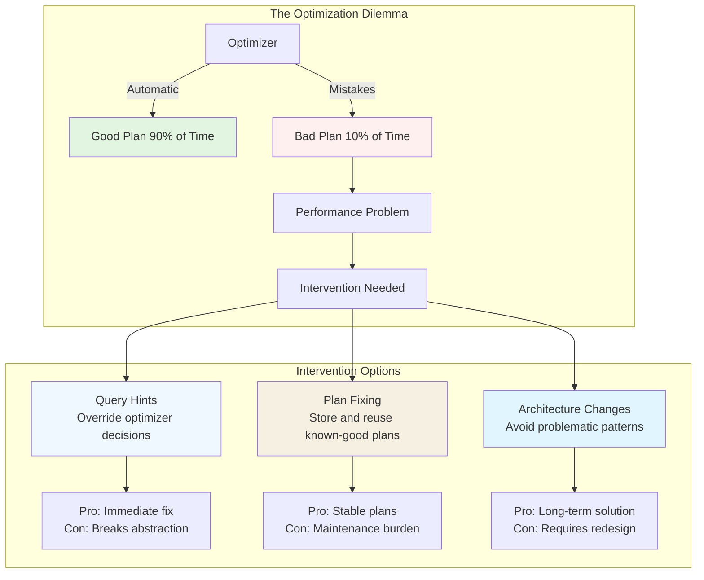
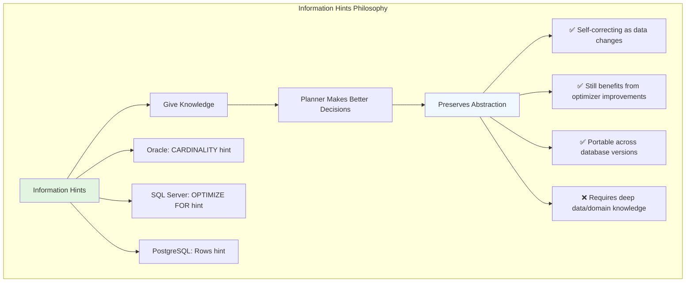
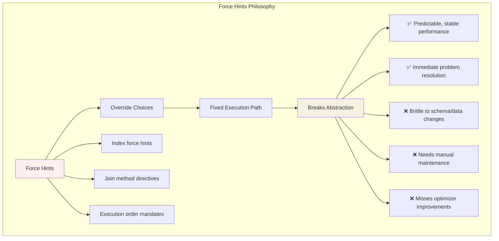
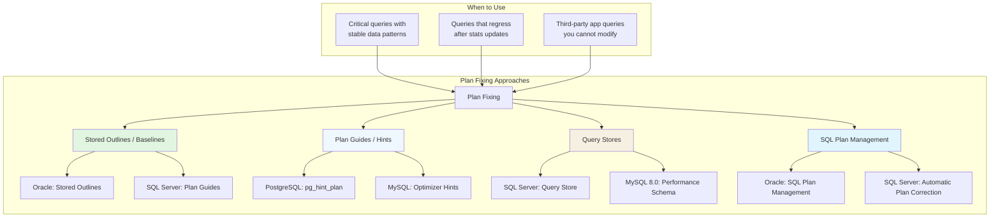
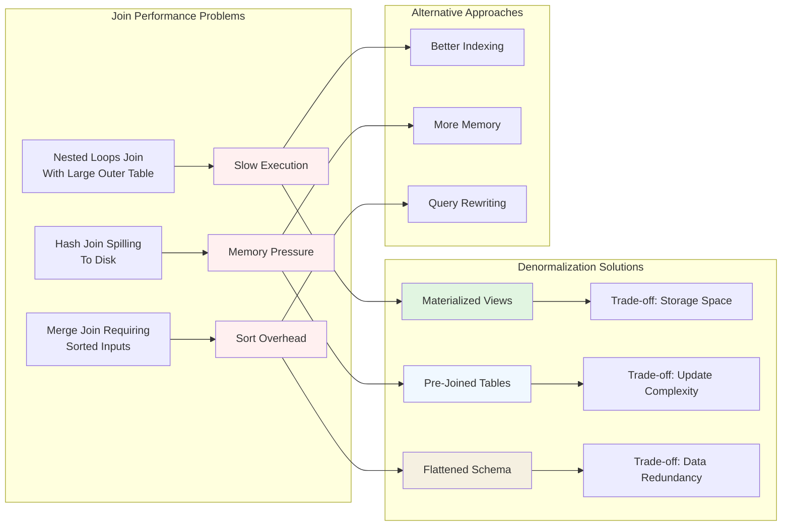
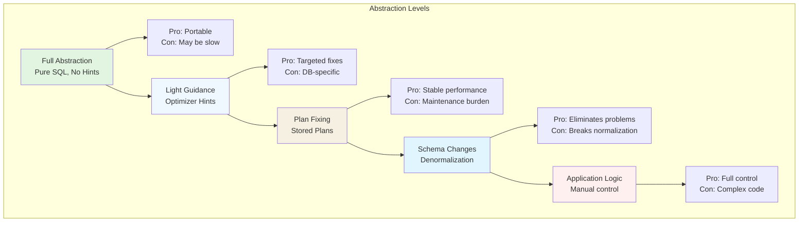

# Hints, Plan Fixing, and Abstraction Trade‑offs

## When the Optimizer Gets It Wrong

Database optimizers are sophisticated but not perfect. When they choose suboptimal execution plans, developers need ways to intervene. This chapter explores three approaches: query hints (explicit instructions), plan fixing (storing known‑good plans), and understanding the abstraction trade‑offs involved.



## Query Hints: Overriding the Optimizer

Query hints are directives embedded in SQL that tell the optimizer how to execute a query. They're a powerful but dangerous tool—use them as a last resort.

### Common Hint Types Across Databases

| Hint Category | Example Hints | Purpose | Databases Supporting |
|---------------|---------------|---------|---------------------|
| **Join Method** | `/*+ HASH_JOIN */`, `/*+ MERGE_JOIN */`, `/*+ NESTED_LOOPS */` | Force specific join algorithm | Oracle, SQL Server (hints), PostgreSQL (pg_hint_plan) |
| **Access Path** | `/*+ INDEX(table idx_name) */`, `/*+ FULL(table) */` | Control index vs full scan | Oracle, SQL Server, MySQL |
| **Execution Order** | `/*+ ORDERED */`, `/*+ LEADING(table1 table2) */` | Control join order | Oracle, PostgreSQL |
| **Parallelism** | `/*+ PARALLEL(table, 4) */` | Control parallel execution | Oracle, SQL Server |
| **Optimizer Goals** | `/*+ FIRST_ROWS */`, `/*+ ALL_ROWS */` | Change cost model | Oracle, SQL Server |
| **Query Block** | `/*+ QB_NAME(subq) */` | Name query blocks for hint targeting | Oracle, MySQL 8.0+ |

### Database‑Specific Hint Syntax

**Oracle:**
```sql
SELECT /*+ INDEX(emp emp_dept_idx) */ emp_id, emp_name
FROM employees emp
WHERE department_id = 100;
```

**SQL Server:**
```sql
SELECT emp_id, emp_name 
FROM employees WITH (INDEX(emp_dept_idx))
WHERE department_id = 100;
-- Or using query hints:
SELECT emp_id, emp_name 
FROM employees 
WHERE department_id = 100
OPTION (MAXDOP 4, MERGE JOIN);
```

**PostgreSQL (via pg_hint_plan extension):**
```sql
/*+ IndexScan(employees emp_dept_idx) */
SELECT emp_id, emp_name 
FROM employees 
WHERE department_id = 100;
```

**MySQL:**
```sql
SELECT emp_id, emp_name 
FROM employees USE INDEX (emp_dept_idx)
WHERE department_id = 100;
-- Or force index:
SELECT emp_id, emp_name 
FROM employees FORCE INDEX (emp_dept_idx)
WHERE department_id = 100;
```

## The Two Philosophies of Hints: Information vs. Force

Query hints fall into two fundamentally different categories that represent contrasting approaches to breaking database abstraction.

### 1. **Information Hints: "I Know Something You Don't"**

These hints **provide missing context** to the optimizer when statistics are incomplete, misleading, or when you have domain knowledge the planner lacks.



**Examples of Information Hints:**

```sql
-- Oracle: Tell optimizer about expected cardinality
SELECT /*+ CARDINALITY(orders, 10000) */ * 
FROM orders 
WHERE customer_id = ? AND status = 'PENDING';

-- SQL Server: Provide guidance for parameterized queries
SELECT * FROM orders 
WHERE region = @region AND order_date > @cutoff
OPTION (OPTIMIZE FOR (@region = 'EU'));  -- "Most queries are for EU"

-- PostgreSQL: Help with correlated subquery estimates
/*+ Rows(correlation_subquery 100) */
SELECT * FROM large_table 
WHERE id IN (SELECT id FROM small_table WHERE condition);

-- Oracle: Inform about data distribution skew
SELECT /*+ DYNAMIC_SAMPLING(orders 4) */ *
FROM orders 
WHERE warehouse_id = ?;  -- Some warehouses have much more data
```

**When to use information hints:** When you have domain knowledge about your data that the optimizer's statistics don't capture.

### 2. **Force Hints: "Do It My Way"**

These hints **dictate specific execution paths**, completely overriding the optimizer's decision-making autonomy.



**Examples of Force Hints:**

```sql
-- MySQL: Force specific index usage
SELECT * FROM orders FORCE INDEX (idx_customer_date)
WHERE customer_id = 123 AND order_date > '2024-01-01';

-- Oracle: Dictate exact join order and method
SELECT /*+ ORDERED LEADING(e d) USE_NL(d) */ *
FROM employees e 
JOIN departments d ON e.dept_id = d.dept_id;

-- SQL Server: Control join algorithm
SELECT * FROM orders o 
INNER HASH JOIN customers c ON o.customer_id = c.id;

-- PostgreSQL: Force parallel execution level
/*+ Parallel(orders 4) */
SELECT COUNT(*) FROM orders WHERE status = 'COMPLETED';
```

**When to use force hints:** When the optimizer consistently makes wrong choices for critical queries with stable data patterns.

## The Abstraction Spectrum of Hint Interventions

```mermaid
graph LR
    subgraph "Abstraction Spectrum"
        A[Pure SQL<br/>Full Abstraction] --> 
        B[Information Hints<br/>"I know something about my data"] --> 
        C[Force Hints<br/>"I know the best execution path"] --> 
        D[Manual Control<br/>No Abstraction]
        
        A --> P1[Max Portability<br/>Automatic Adaptation]
        B --> P2[Enhanced Decisions<br/>Preserved Autonomy]
        C --> P3[Fixed Execution<br/>Broken Autonomy]
        D --> P4[Total Control<br/>Full Responsibility]
    end
    
    subgraph "Maintenance Burden Increases"
        MB[← Lower Maintenance] --> A
        A --> B
        B --> C
        C --> D
        D --> MB2[Higher Maintenance →]
    end
    
    style A fill:#e1f5e1
    style B fill:#f0f8ff
    style C fill:#f5f0e1
    style D fill:#fff0f0
```

### Why This Distinction Matters

1. **Maintenance Implications:**
   - **Information hints** adapt as data changes (self‑correcting)
   - **Force hints** become incorrect as data evolves (brittle)

2. **Optimizer Evolution:**
   - **Information hints** work with future optimizer improvements
   - **Force hints** may prevent benefiting from new optimizations

3. **Portability:**
   - **Information hints** have similar concepts across databases
   - **Force hints** are highly database‑specific

4. **Debugging Complexity:**
   - **Information hints** are "why" focused (explain the data)
   - **Force hints** are "how" focused (specify the execution)

### Hybrid Approach: Hinted Abstraction

Modern systems increasingly support both approaches, allowing you to mix them:

```sql
-- SQL Server: Information + force hints together
SELECT * FROM large_table lt
JOIN small_table st ON lt.id = st.id
WHERE lt.category = @category
OPTION (
  OPTIMIZE FOR (@category = 'ELECTRONICS'),  -- Information
  USE HINT ('FORCE_DEFAULT_CARDINALITY_ESTIMATION'), -- Force
  LOOP JOIN  -- Force
);

-- Oracle: Multiple hint types
SELECT /*+ 
  CARDINALITY(orders 1000)     -- Information hint
  INDEX(orders idx_status)      -- Force hint  
  NO_EXPAND                     -- Force hint
*/ * FROM orders 
WHERE status = 'PENDING' 
  AND order_date > SYSDATE - 7;
```

## Decision Framework: Which Type to Use?

| Scenario | Recommended Approach | Reasoning |
|----------|---------------------|-----------|
| **Missing statistics** | Information hints | Give optimizer what it's missing |
| **Consistent wrong choice** | Force hints | Override repeatedly bad decisions |
| **Data skew known** | Information hints | Share domain knowledge |
| **Critical query, stable pattern** | Force hints | Ensure predictable performance |
| **Evolving data** | Information hints | Allows adaptation |
| **Third‑party application** | Force hints (via plan guides) | Can't modify queries |

**Rule of thumb:** Start with information hints when possible. Reserve force hints for cases where:
1. The optimizer is consistently wrong
2. The query pattern is stable
3. Performance impact is significant
4. You're willing to maintain the hint as data changes

This distinction is fundamental to understanding the abstraction trade‑offs in database optimization. Information hints work within the abstraction; force hints break it.

## Plan Fixing: Storing Known‑Good Plans

When a query has a stable, known‑good execution plan, some databases allow you to "fix" or store that plan for reuse.

### Plan Stability Techniques



### Oracle SQL Plan Management (SPM)
```sql
-- Capture a good plan
DECLARE
  my_plans PLS_INTEGER;
BEGIN
  my_plans := DBMS_SPM.LOAD_PLANS_FROM_CURSOR_CACHE(
    sql_id => 'abc123def456'
  );
END;
/

-- Fix a plan as "accepted"
EXEC DBMS_SPM.ALTER_SQL_PLAN_BASELINE(
  sql_handle => 'SYS_SQL_abc123',
  plan_name  => 'SYS_SQL_PLAN_abc123',
  attribute_name => 'FIXED',
  attribute_value => 'YES'
);
```

### SQL Server Plan Guides
```sql
-- Create a plan guide for a query you can't modify
EXEC sp_create_plan_guide
  @name = N'Guide1',
  @stmt = N'SELECT * FROM Sales.Orders WHERE CustomerID = @CustomerID',
  @type = N'SQL',
  @module_or_batch = NULL,
  @params = N'@CustomerID INT',
  @hints = N'OPTION (OPTIMIZE FOR (@CustomerID = 1))';
```

### PostgreSQL pg_hint_plan
```sql
-- Store hints in a hints table
INSERT INTO hint_plan.hints 
  (id, norm_query_string, application_name, hints)
VALUES 
  (1, 
   'SELECT * FROM t1 WHERE id = ?;',
   'myapp',
   'IndexScan(t1)');
```

## Avoiding Joins: Denormalization Strategies

Sometimes the best way to fix a query performance problem is to avoid the problematic pattern entirely—often by denormalizing data to eliminate joins.

### When to Consider Denormalization



### Denormalization Patterns

1. **Materialized Views**
```sql
-- Instead of expensive join every time:
SELECT c.name, SUM(o.amount) as total
FROM customers c 
JOIN orders o ON c.id = o.customer_id
GROUP BY c.id, c.name;

-- Create materialized view:
CREATE MATERIALIZED VIEW customer_totals AS
SELECT c.id, c.name, SUM(o.amount) as total
FROM customers c 
JOIN orders o ON c.id = o.customer_id
GROUP BY c.id, c.name;

-- Query becomes:
SELECT name, total FROM customer_totals;
```

2. **Pre‑Joined Tables**
```sql
-- Instead of joining at query time:
SELECT o.*, c.name, c.email 
FROM orders o 
JOIN customers c ON o.customer_id = c.id;

-- Add redundant columns to orders:
ALTER TABLE orders ADD COLUMN customer_name VARCHAR(100);
ALTER TABLE orders ADD COLUMN customer_email VARCHAR(255);

-- Update via triggers or application logic
-- Query becomes simple:
SELECT * FROM orders;
```

3. **Flattened Documents (NoSQL Style)**
```sql
-- Relational: Multiple tables with joins
-- Orders table + Order_Items table + Products table

-- Flattened: Single document‑style table
CREATE TABLE order_documents (
  order_id INT PRIMARY KEY,
  order_data JSONB  -- Contains customer, items, products
);

-- Query with no joins:
SELECT order_data->>'customer_name' as customer,
       order_data->'items' as items
FROM order_documents
WHERE order_data->>'status' = 'COMPLETED';
```

## The Abstraction Trade‑off Pyramid



**Rule of Thumb:** Start at the top of the pyramid (full abstraction) and only move down when you have measurable performance problems and evidence that the lower level solves them.

## Real‑World Case Studies

### Case 1: E‑Commerce Reporting Query
**Problem:** Daily sales report joining 8 tables takes 45 minutes.
**Attempt 1:** Added hints for join order → 30 minutes (better but not enough)
**Attempt 2:** Created plan guide with fixed plan → 25 minutes
**Solution:** Created materialized view updated nightly → 3 seconds
**Trade‑off:** Data is 24 hours stale, but acceptable for reporting

### Case 2: Mobile App User Feed
**Problem:** `JOIN` between users, posts, comments, likes causes N+1 queries in ORM.
**Attempt 1:** Added `/*+ USE_NL */` hints → Reduced but still slow
**Attempt 2:** Created covering indexes → Better but index maintenance expensive
**Solution:** Created flattened `user_feed` table updated via change data capture
**Trade‑off:** Eventually consistent (∼1 second delay) but 100x faster reads

### Case 3: Financial System Batch Processing
**Problem:** Month‑end processing query changes plan unpredictably.
**Attempt 1:** Tried various hints → Sometimes worked, sometimes made worse
**Attempt 2:** Used SQL Plan Management to capture good plan → Stable but rigid
**Solution:** Split query into two parts with explicit intermediate temp table
**Trade‑off:** More code complexity but predictable performance

## Best Practices for Plan Intervention

1. **Measure First** – Use `EXPLAIN ANALYZE`, execution plans, wait statistics
2. **Test Rigorously** – Hints that help today may hurt tomorrow with different data
3. **Document Everything** – Why the hint/fix was added, what problem it solved
4. **Review Periodically** – Remove hints/fixes that are no longer needed
5. **Consider the Whole System** – A hint that fixes one query may hurt others

## Anti‑Patterns to Avoid

❌ **Hint‑happy development** – Adding hints without understanding why
❌ **Plan guide sprawl** – Hundreds of plan guides no one understands
❌ **Denormalization frenzy** – Flattening everything "just in case"
❌ **Ignoring root causes** – Using hints to paper over bad schema design
❌ **Production‑only fixes** – Hints in production but not in development/test

## The Future: AI‑Driven Optimization

Emerging trends:
- **Automatic hint generation** – ML models suggest hints based on execution history
- **Plan regression detection** – Systems that automatically detect when plans get worse
- **Self‑healing databases** – Automatically apply fixes when problems detected
- **Cost‑based hint evaluation** – Systems that predict hint impact before applying

## Summary: The Right Tool for the Job

| Problem | First Try | Second Try | Nuclear Option |
|---------|-----------|------------|----------------|
| **Wrong join method** | Better statistics | Index hints | Plan guide with fixed join order |
| **Bad index choice** | Analyze table | Force index hint | Covering index or materialized view |
| **Unpredictable plans** | Query store monitoring | Optimizer hints | SQL Plan Management |
| **Too many joins** | Query rewriting | Denormalized columns | Materialized view |
| **Parameter sniffing** | `OPTIMIZE FOR` hint | Plan forcing | Split into multiple queries |

**Remember:** Every intervention breaks some abstraction. The key is to understand what you're trading off and whether it's worth it for your specific use case.

---

**Key Takeaway:** Database abstraction exists to make development easier, but performance sometimes requires piercing the abstraction veil. Do it thoughtfully, document it thoroughly, and always measure the impact.

**Next Section:** The **Query Execution** part begins with Chapter 5.1.1, exploring how databases actually run queries once the plan is chosen.